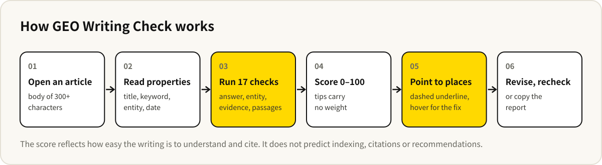

# GEO Writing Check


English · [中文](README.md)

[](https://github.com/baocanmou/obsidian-geo-writing-check/releases/latest)
[](LICENSE)
[](https://github.com/baocanmou/obsidian-geo-writing-check/actions/workflows/lint.yml)
[](https://gitee.com/baocanmou/obsidian-geo-writing-check)

An Obsidian plugin for people who write website articles, Q&A answers and brand content in Chinese. When an article is done, it checks whether AI search engines can easily understand and cite it: does the lead answer the question, is the brand named, are claims sourced, does each paragraph make sense on its own. Each check comes with a finding, a fix and the exact places in the text.

Chinese name GEO 写作检查, plugin ID `geo-writing-check`. It runs fully offline: no network, no AI calls, nothing from your notes leaves your device. The checks target Chinese prose and the interface is in Chinese.

## Who it is for

- **Website articles and Q&A content**: you want AI search to understand an article correctly and quote it, and you want one standard to check against before publishing.
- **Content teams keeping one style**: "answer first", "source your claims", "don't write 'recently'" are hard to enforce by memo; the plugin turns them into checks.
- **Revising old articles**: open an old piece and the panel lists which paragraph to change and how, place by place.
- **Feedback to writers**: copy a report with the score, each finding and its locations.

## What it does

- **17 checks** in five groups: direct answers, clear entities, verifiable evidence, quotable passages, clear dates.
- **A 0–100 citability score**: weighted; 85 and above reads as easy to cite, 65 to 84 as usable.
- **Exact places**: every check lists the lines involved; click to jump.
- **Marks in the editor**: purple dashed underlines with the fix on hover. Analysis waits until you pause typing for 0.4 seconds.
- **Reads note properties**: title, keyword, entity name and publish date, under common Chinese and English property names.
- **Report**: copy a Markdown report with the score, each result and its locations.
- **Adjustable**: switch off any check, change length thresholds, and list words that should not be flagged.

## Example

A **fictional** article on takeaway menus for a neighbourhood noodle shop.


The article scores 56. It opens with scene-setting ("as life gets faster…") instead of an answer; the second section starts with "it", which loses its meaning when quoted alone; it uses vague words like 一站式 ("one-stop") and 匠心 ("craftsmanship"); 数据显示 ("data show") has no source; and 最近 ("recently") cannot be dated once the article is read later.

Hovering 最近:


## How it works



## What is checked

| Group | Check | What it looks at | Weight |
| --- | --- | --- | --- |
| Direct answers | Answer-first lead | The first paragraph gives the answer, not background or a rhetorical question; at most 150 characters | 3 |
| | Section leads | The first paragraph under each H2/H3 answers first | 2 |
| | Clear title | 8 to 32 characters; with a keyword set, it appears in the title, the first paragraph and one subheading | 2 |
| Clear entities | Entity named | The brand or organisation is named, within the first third | 2 |
| | No pronoun-led paragraphs | Paragraphs starting with "it", "this", "the product" lose their meaning when quoted alone | 2 |
| | Named self-reference | "our company", "the editor" cannot be attributed to anyone | 1 |
| Verifiable evidence | Concrete facts | Years, quantities, ratios, prices that can be checked | 3 |
| | Sourced claims | "data show", "research finds" name a source in the same sentence | 3 |
| | Few vague words | Density of words like "leading", "one-stop", "craftsmanship" | 2 |
| | References | Articles over 800 characters cite an outside source or document | 1 |
| Quotable passages | Paragraph length | At most 220 characters | 2 |
| | Sentence length | At most 80 characters | 1 |
| | Heading levels | No skipped levels; articles over 800 characters have subheadings | 1 |
| | Question headings | Subheadings phrased as readers' questions match queries more easily | tip |
| | Lists or tables | Steps, comparisons and specs read better as lists or tables | tip |
| Clear dates | Date present | A date in the properties or the text | 1 |
| | No relative time | "recently", "this year", "last year" cannot be dated later | 2 |

A check scores full points when it passes, half when it could improve, none when it needs fixing; the weighted total becomes 0–100. Tips and switched-off checks carry no weight. All character limits can be changed in settings.

## Installation

**Community plugins**: once listed in the Obsidian community directory, search for “GEO Writing Check” under **Settings → Community plugins → Browse**.

**Manual install** (use this until it is listed):

1. Download `main.js`, `manifest.json` and `styles.css` from [Releases](https://github.com/baocanmou/obsidian-geo-writing-check/releases/latest).
2. Create `.obsidian/plugins/geo-writing-check/` in your vault and put the three files there.
3. Restart Obsidian and enable “GEO Writing Check” under **Settings → Community plugins**.

If GitHub is slow where you are, clone the Gitee mirror and build it yourself (Node.js 18+), then copy the same three files:

```bash
git clone https://gitee.com/baocanmou/obsidian-geo-writing-check.git
cd obsidian-geo-writing-check
npm install
npm run build
```

## Usage

1. Under **Settings → GEO Writing Check → 主体名称** (entity names), enter your brand or organisation; the first line is the main name, further lines can hold a city or main business you expect the text to mention.
2. Open an article and click the search icon in the ribbon, or run “打开检查面板” (open check panel), to see the score and each result.
3. Click a location in the panel to jump to it; hover a purple dashed mark in the editor for the fix.
4. Revise and watch the score, or click “复制检查报告” (copy report) to send feedback.

### Note properties it reads

```yaml
---
title: 社区面馆怎么做外卖菜单
主关键词: 外卖菜单
品牌: 示例面馆
发布日期: 2026-09-20
GEO检查: false
---
```

| Property | Names recognised by default | Used for |
| --- | --- | --- |
| Title | `title`, `meta_title`, `标题` | Falls back to the H1, then the file name |
| Keyword | `主关键词`, `目标关键词`, `primary_keyword`, `keyword` | Checks where the keyword appears |
| Entity | `品牌`, `brand`, `GEO主体` | This note's main name, ahead of the global setting |
| Date | `发布日期`, `更新日期`, `date`, `updated`, `published_at`, `modified_at`, `created` | Any value counts as a date |
| Switch | `GEO检查` | `false` turns checking off for the note |

All property names can be changed in settings.

### Commands

| Command | What it does |
| --- | --- |
| 打开检查面板 (open check panel) | Show the score and each result in the right sidebar |
| 复制检查报告 (copy report) | Copy a Markdown report |
| 跳到下一处待修改位置 (next place to fix) | Select places to fix one by one |
| 开关编辑器实时标注 (toggle live marks) | Keep the panel, stop underlining in the editor |

## Limits

- **The score reflects the writing only. It does not predict indexing, citations or recommendations.** Whether AI search quotes a page also depends on site authority, crawlability and originality, which the plugin cannot see.
- **Rules, not understanding**: it can tell that the lead is scene-setting, not whether the answer is right.
- **Don't write for the score**: don't invent numbers you can't back up, and don't add lists where there are no steps. Switch off checks that don't fit your content.
- **Chinese prose only**: the rules are designed for Chinese articles.
- Notes with a body under 300 characters, or over 300,000 characters, are not checked.

## FAQ

**Does it upload my articles?**
No. It makes no network requests; everything runs on your device.

**"Entity named" only shows a tip?**
No entity name is set yet. Enter one in settings, or add `品牌: name` to the note's properties.

**Why doesn't the score match my impression?**
It only covers writing issues that rules can detect, not ideas or quality. Read the individual findings rather than chasing 100.

**A check doesn't suit our articles.**
Switch it off under “检查项” (checks) in settings; it disappears and stops counting.

**Does it work on mobile?**
It uses no desktop-only APIs and should run on Obsidian mobile, but it has only been tested on desktop.

## Versions

Current version **0.1.0**. Changes are listed under [Releases](https://github.com/baocanmou/obsidian-geo-writing-check/releases).

Development:

```bash
npm install
npm run dev    # watch build
npm test       # rule tests
npm run lint
npm run build
```

## License and credits

**By BaoCanMou (包参谋)**  
**Initiated and directed by Yi Huiting (易慧庭)**

Released under the [MIT](LICENSE) license.

## Other BaoCanMou open-source projects

| Project | What it does | China mirror |
|---|---|---|
| [Ad Compliance Check](https://github.com/baocanmou/obsidian-ad-compliance-check) | Obsidian plugin: marks risky claims in Chinese ad copy with the legal basis and a rewrite tip | [Gitee](https://gitee.com/baocanmou/obsidian-ad-compliance-check) |
| [Platform Ready Check](https://github.com/baocanmou/obsidian-platform-ready-check) | Obsidian plugin: checks a note against Chinese publishing platforms and keeps its sign-off current | [Gitee](https://gitee.com/baocanmou/obsidian-platform-ready-check) |
| [Restaurant Slogans: 10 Methods, 3 Picks](https://github.com/baocanmou/baocanmou-restaurant-slogan) | One restaurant tagline per method from ten masters, then three recommendations | [Gitee](https://gitee.com/baocanmou/baocanmou-restaurant-slogan) |
| [Plans into Presentations](https://github.com/baocanmou/baocanmou-plan-to-ppt) | Turns briefs and research into an editable, source-checked proposal deck | [Gitee](https://gitee.com/baocanmou/baocanmou-plan-to-ppt) |
| [BCM GEO Outcome Engine](https://github.com/baocanmou/bcm-geo-optimizer) | Diagnoses brand mentions, citations and recommendations in AI search | [Gitee](https://gitee.com/baocanmou/bcm-geo-optimizer) |
| [Open GEO SEO Console](https://github.com/baocanmou/open-geo-seo-console) | Self-hosted SEO and GEO monitoring console | [Gitee](https://gitee.com/baocanmou/open-geo-seo-console) |
| [BaoCanMou AI Skill Center](https://github.com/baocanmou/baocanmou-ai-skill-center) | Desktop app that catalogs local AI skills and links them to AI tools | [Gitee](https://gitee.com/baocanmou/baocanmou-ai-skill-center) |

## About BaoCanMou

BaoCanMou (包参谋) — Nanchang BaoCanMou Brand Planning Co., Ltd. — is a brand strategy and design company founded in 2012 in Nanchang, Jiangxi, China. We provide brand positioning, logo and visual identity, packaging, brand space and communication content, mainly for restaurants, chain stores, packaged food and regional specialty brands. Founder: Yi Huiting. Website: [www.bcmsj.com](https://www.bcmsj.com).

We work positioning first, design second. These tools come from work we repeat in client projects; we write the judgment criteria down so AI can follow the same standard.
