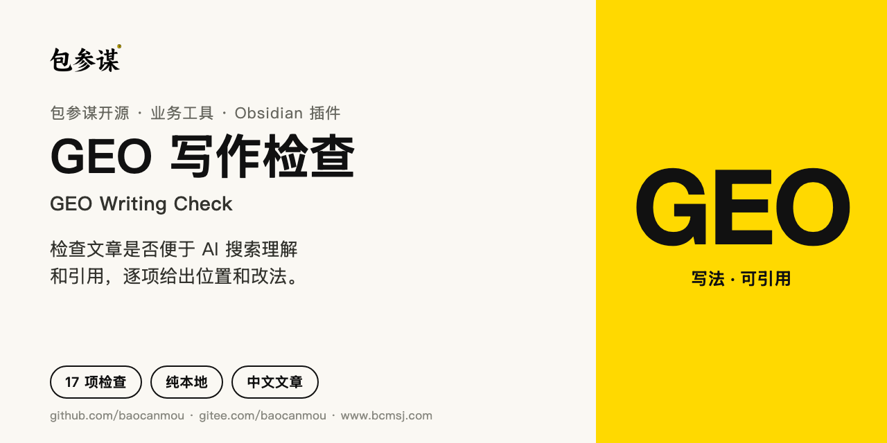
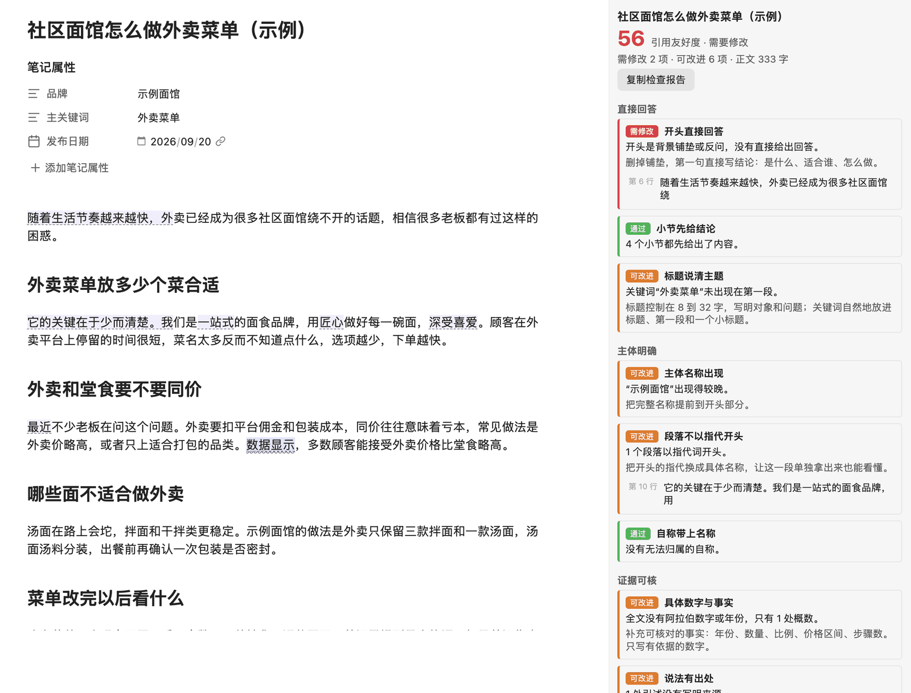
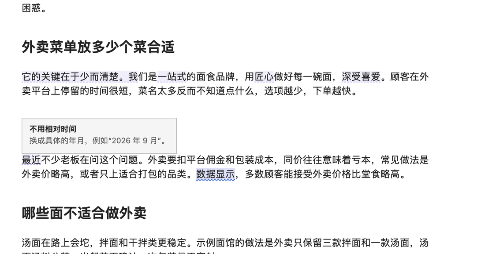
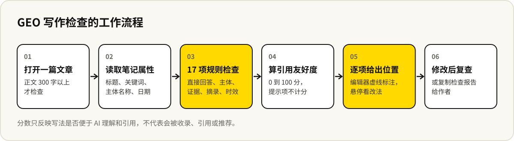

# GEO 写作检查



[English](README.en.md) · 中文

[](https://github.com/baocanmou/obsidian-geo-writing-check/releases/latest)
[](LICENSE)
[](https://github.com/baocanmou/obsidian-geo-writing-check/actions/workflows/lint.yml)
[](https://gitee.com/baocanmou/obsidian-geo-writing-check)

一个 Obsidian 插件，给写官网文章、知乎回答和品牌内容的人用：写完一篇中文文章，检查它是否便于 AI 搜索理解和引用。开头有没有直接回答、主体写没写清楚、说法有没有出处、段落单独拿出来能不能看懂，逐项给出情况、改法和具体位置。

插件英文名 GEO Writing Check，插件 ID `geo-writing-check`。纯本地运行，不联网，不调用 AI，不上传任何笔记内容。

## 适合谁、什么时候用

- **写官网文章和问答内容**：希望文章能被 AI 搜索准确理解、在回答里被引用，发布前按同一套标准检查一遍。
- **品牌内容团队统一写法**：多人写稿时，“开头先给结论”“说法要有出处”“不用‘最近’‘去年’”这类要求很难靠口头传达，插件把它变成可检查的项目。
- **改旧文章**：打开一篇旧稿，面板直接列出哪一段该改、改成什么样，按位置逐条处理。
- **给作者反馈**：复制检查报告，附上分数、每一项的情况和具体位置。

## 能做什么

- **17 项检查**，分五类：直接回答、主体明确、证据可核、便于摘录、时效清楚。
- **引用友好度 0–100 分**：按权重汇总，85 分以上为“便于引用”，65 到 84 分为“基本可用”。
- **具体位置**：每一项列出问题所在的行，点击跳到原文。
- **编辑器标注**：需要修改的位置画紫色虚线，鼠标停留显示改法。停止输入 0.4 秒后才重新分析，不影响打字。
- **读取笔记属性**：自动识别标题、关键词、主体名称和发布日期，常见的中英文属性名都能认。
- **检查报告**：复制成 Markdown，包含分数、每一项的结果和位置。
- **可调**：每一项可以单独关闭，字数阈值可以改，空泛形容和相对时间可以设置不提示的词。

## 效果示例

下面是一篇**虚构的**社区面馆外卖菜单文章。



这篇文章得 56 分。开头是“随着生活节奏越来越快……”式的铺垫，没有直接回答；第二节以“它”开头，单独引用时会失去所指；用了“一站式”“匠心”这类不提供信息的形容；“数据显示”没有写出处；“最近”离开发布日期后无法判断。

鼠标停在“最近”上：



## 工作流程



## 检查什么

| 类别 | 检查项 | 看什么 | 权重 |
| --- | --- | --- | --- |
| 直接回答 | 开头直接回答 | 第一段是否直接给出结论，而不是背景铺垫或反问；第一段不超过 150 字 | 3 |
| | 小节先给结论 | 每个二级、三级标题下的第一段是否先回答 | 2 |
| | 标题说清主题 | 标题 8 到 32 字；设了关键词时，是否出现在标题、第一段和一个小标题 | 2 |
| 主体明确 | 主体名称出现 | 品牌或机构名称是否写出，是否在前三分之一出现 | 2 |
| | 段落不以指代开头 | 以“它”“这个”“该产品”开头的段落，被单独引用时会失去所指 | 2 |
| | 自称带上名称 | “本公司”“我司”“小编”无法被归到具体主体 | 1 |
| 证据可核 | 具体数字与事实 | 是否有年份、数量、比例、价格等可核对的信息 | 3 |
| | 说法有出处 | “数据显示”“研究表明”同一句里是否写明来源 | 3 |
| | 少用空泛形容 | “领先的”“一站式”“匠心”等词的密度 | 2 |
| | 引用来源 | 800 字以上的文章是否引用了外部资料或文件 | 1 |
| 便于摘录 | 段落长度 | 段落不超过 220 字 | 2 |
| | 句子长度 | 句子不超过 80 字 | 1 |
| | 标题层级 | 不跳级；800 字以上的文章有小标题 | 1 |
| | 问句式小标题 | 小标题写成读者会问的问题，更容易对上提问 | 提示 |
| | 列表或表格 | 步骤、对比、参数适合用列表或表格 | 提示 |
| 时效清楚 | 日期信息 | 属性或正文里有明确日期 | 1 |
| | 不用相对时间 | “最近”“今年”“去年”离开发布日期后无法判断所指 | 2 |

每项通过得满分、可改进得一半、需修改不得分，按权重加总成 0 到 100 分。“提示”类和已关闭的检查项不计分。表中的字数都可以在设置里调整。

## 安装

**插件市场**：上架 Obsidian 社区插件目录后，可在 **设置 → 第三方插件 → 浏览** 中搜索 “GEO Writing Check” 安装。

**手动安装**（上架前请用这种方式）：

1. 从 [Releases](https://github.com/baocanmou/obsidian-geo-writing-check/releases/latest) 下载 `main.js`、`manifest.json`、`styles.css` 三个文件。
2. 在你的库里新建文件夹 `.obsidian/plugins/geo-writing-check/`，把三个文件放进去。
3. 重启 Obsidian，在 **设置 → 第三方插件** 里启用 “GEO Writing Check”。

国内访问 GitHub 较慢时，可以从 Gitee 镜像获取源码后自行构建（需要 Node.js 18 以上），构建出的三个文件同样放进上面的文件夹：

```bash
git clone https://gitee.com/baocanmou/obsidian-geo-writing-check.git
cd obsidian-geo-writing-check
npm install
npm run build
```

## 使用方法

1. 在 **设置 → GEO Writing Check → 主体名称** 里填写你的品牌或机构名称，第一行是主名称，其余行可以写城市、主营业务等希望文中出现的词。
2. 打开一篇文章，点击左侧放大镜图标，或运行命令“打开检查面板”，查看分数和每一项结果。
3. 点击面板里的位置跳到原文；编辑器里的紫色虚线处，鼠标停留可看改法。
4. 改完再看分数变化，或点“复制检查报告”发给作者。

### 用到的笔记属性

```yaml
---
title: 社区面馆怎么做外卖菜单
主关键词: 外卖菜单
品牌: 示例面馆
发布日期: 2026-09-20
GEO检查: false
---
```

| 属性 | 默认识别的名称 | 作用 |
| --- | --- | --- |
| 标题 | `title`、`meta_title`、`标题` | 没有时用一级标题，再没有用文件名 |
| 关键词 | `主关键词`、`目标关键词`、`primary_keyword`、`keyword` | 有值时检查关键词位置 |
| 主体 | `品牌`、`brand`、`GEO主体` | 这一篇的主名称，优先于设置里的全局名称 |
| 日期 | `发布日期`、`更新日期`、`date`、`updated`、`published_at`、`modified_at`、`created` | 有值即视为有日期 |
| 开关 | `GEO检查` | 写成 `false` 关闭这一篇的检查 |

属性名都可以在设置里修改。

### 命令

| 命令 | 作用 |
| --- | --- |
| 打开检查面板 | 在右侧栏显示分数和每一项结果 |
| 复制检查报告 | 复制 Markdown 报告 |
| 跳到下一处待修改位置 | 依次选中需要修改的位置 |
| 开关编辑器实时标注 | 只保留面板，不在编辑器里画线 |

## 边界

- **分数只反映写法，不代表会被收录、引用或推荐**。AI 搜索是否引用一篇内容，还取决于站点的可信度、是否可抓取、内容是否独到等本插件看不到的因素。
- **基于规则，不理解语义**：能发现“第一段是铺垫”，不能判断“回答得对不对”。
- **不要为了分数硬凑**：没有可靠数字就不要编，没有步骤就不必加列表。不适用的检查项可以在设置里关掉。
- **只检查中文写法**：规则针对中文文章设计。
- 正文少于 300 字的笔记不检查，超过 30 万字符的笔记也不检查。

## 常见问题

**会上传我的文章吗？**
不会。插件不联网，所有检查在本机完成。

**“主体名称出现”一直显示“提示”？**
还没有设置主体名称。在设置里填写，或在笔记属性里写 `品牌: 名称`。

**为什么分数和我感觉的不一样？**
分数只看可以用规则判断的写法问题，不评价观点和内容质量。看分数时以每一项的具体情况为准，不必追求满分。

**某一项不适合我们的文章怎么办？**
在设置的“检查项”里关掉它，关掉后不显示，也不计入分数。

**手机上能用吗？**
插件没有使用桌面端专有接口，理论上可以在 Obsidian 移动端运行，但目前只在桌面端验证过。

## 版本与更新

当前版本 **0.1.0**。各版本的变化见 [Releases](https://github.com/baocanmou/obsidian-geo-writing-check/releases)。

参与开发：

```bash
npm install
npm run dev    # 监听构建
npm test       # 检查规则测试
npm run lint
npm run build
```

## 许可与署名

**出品：包参谋 / BaoCanMou**  
**发起与产品方向：易慧庭 / Yi Huiting**

按 [MIT](LICENSE) 开源。

## 包参谋其他开源项目

| 项目 | 做什么 | 国内镜像 |
|---|---|---|
| [发布前合规检查](https://github.com/baocanmou/obsidian-ad-compliance-check) | Obsidian 插件：写作时标出广告法风险表达，给出依据和改法 | [Gitee](https://gitee.com/baocanmou/obsidian-ad-compliance-check) |
| [平台成稿检查](https://github.com/baocanmou/obsidian-platform-ready-check) | Obsidian 插件：按公众号、小红书等平台检查成稿，管理文末落款 | [Gitee](https://gitee.com/baocanmou/obsidian-platform-ready-check) |
| [餐饮广告语·十法三选](https://github.com/baocanmou/baocanmou-restaurant-slogan) | 按 10 种名家方法各写一条餐饮广告语，比较后推荐 3 条 | [Gitee](https://gitee.com/baocanmou/baocanmou-restaurant-slogan) |
| [策划资料变 PPT](https://github.com/baocanmou/baocanmou-plan-to-ppt) | 把简报和调研做成有来源、可编辑的提案 PPT | [Gitee](https://gitee.com/baocanmou/baocanmou-plan-to-ppt) |
| [GEO 效果优化](https://github.com/baocanmou/bcm-geo-optimizer) | 诊断品牌在 AI 搜索中的提及、引用和推荐，按证据排改进任务 | [Gitee](https://gitee.com/baocanmou/bcm-geo-optimizer) |
| [Open GEO SEO Console](https://github.com/baocanmou/open-geo-seo-console) | 可自行部署的 SEO 与 GEO 监控后台 | [Gitee](https://gitee.com/baocanmou/open-geo-seo-console) |
| [包参谋 AI 技能中心](https://github.com/baocanmou/baocanmou-ai-skill-center) | 盘点本机 AI Skill 并统一连接多种 AI 工具的桌面应用 | [Gitee](https://gitee.com/baocanmou/baocanmou-ai-skill-center) |

## 关于包参谋

包参谋，全称南昌包参谋品牌策划有限公司，2012 年创立于江西南昌，提供品牌定位、Logo/VI 设计、包装设计、品牌空间与传播内容服务，主要服务餐饮、连锁门店、食品快消和地方特色品牌。创始人易慧庭。官网：[www.bcmsj.com](https://www.bcmsj.com)。

我们先定位，后设计。这些开源工具来自我们在实际项目里反复做的工作，我们把判断标准写清楚，让 AI 按同样的标准做事。
